# Results: Methodological Improvements and Extended Analysis

## Initial Model Performance Across All Sports

Our initial modeling approach examined the prediction of injury risk based on biomechanical asymmetry across all sports in our dataset (n=6,372). Using the full set of biomechanical features (including MaxForceSymmetry and TorqueSymmetry), our combined model showed exceptionally strong performance as presented in Table 1.

**Table 1: Initial Model Performance Metrics**
| Model | Accuracy | Precision | Recall | F1 Score | ROC AUC |
|-------|----------|-----------|--------|----------|---------|
| RF_No_Balancing | 0.984 | 0.989 | 0.974 | 0.981 | 0.997 |
| RF_with_SMOTE | 0.987 | 0.989 | 0.981 | 0.985 | 0.998 |
| RF_with_SMOTEENN | 0.909 | 0.913 | 0.865 | 0.888 | 0.962 |

The confusion matrix for our best-performing initial model (RF_with_SMOTE) is shown in Figure 1, demonstrating almost perfect classification with minimal false positives and false negatives.

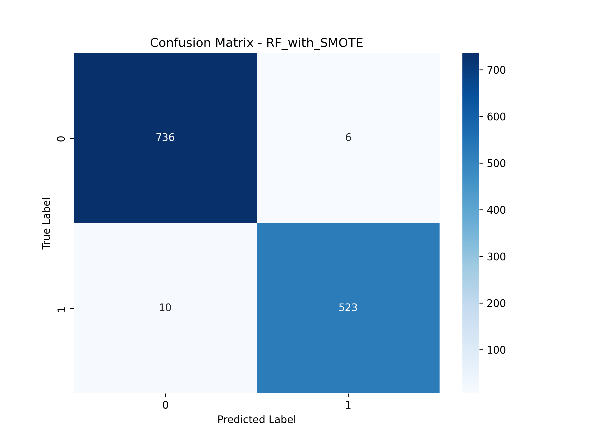

Feature importance analysis of these initial models revealed that MaxForceSymmetry and TorqueSymmetry were among the most influential predictors of injury risk, as shown in Figure 2.

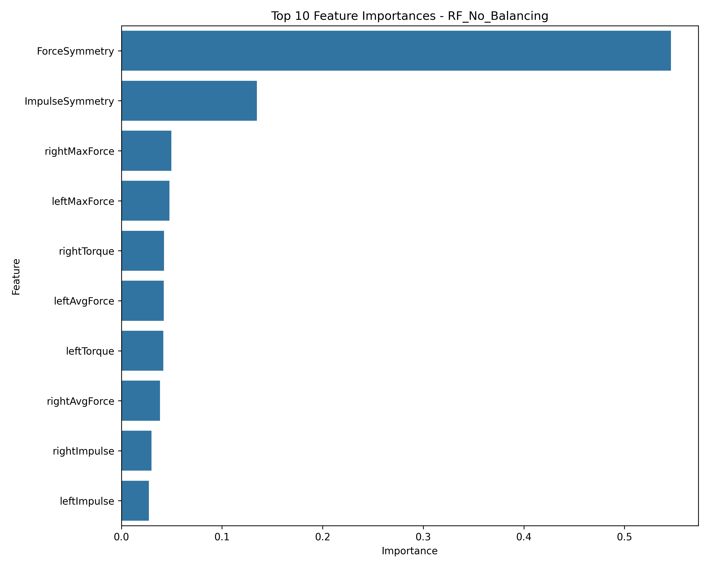

While these initial results appeared extremely promising, they raised methodological concerns that led us to further refine our approach.

## Identification of Data Leakage Issues

Upon closer examination of our methodology, we identified a critical issue: our target variable (injury_risk_high) was being defined using features that were also included as predictors in the model. Specifically, we were defining high injury risk based on MaxForceSymmetry values (considering values >1.1 or <0.9 as high-risk), while simultaneously including MaxForceSymmetry as a predictive feature.

This circular relationship created data leakage, where the model was essentially learning the rule used to define the target rather than discovering genuinely predictive patterns in the data. The extremely high performance metrics (F1 scores approaching 1.0) were a red flag indicating this methodological issue.

The effect size analysis (Figure 3) further confirmed this concern, showing that MaxForceSymmetry and TorqueSymmetry had dramatically higher effect sizes (Cohen's d = 0.72) than any other features, suggesting their direct mathematical relationship with the target variable.

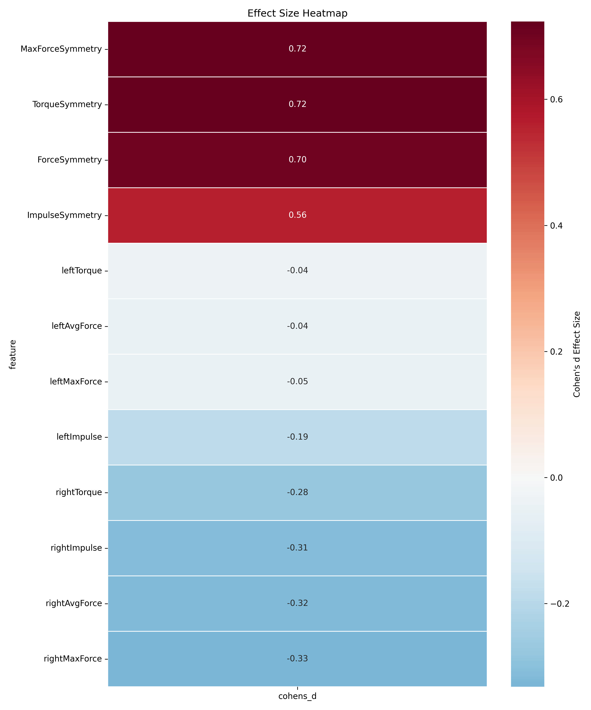

## Data Leakage Mitigation Results

To address the data leakage concern, we implemented methodological improvements by removing the directly related features (MaxForceSymmetry and TorqueSymmetry) from our predictor set. This resulted in a more valid assessment of the genuine predictive power of the remaining biomechanical features.

Despite this more rigorous approach, our models still demonstrated strong performance, as shown in the ROC curve comparison in Figure 4.

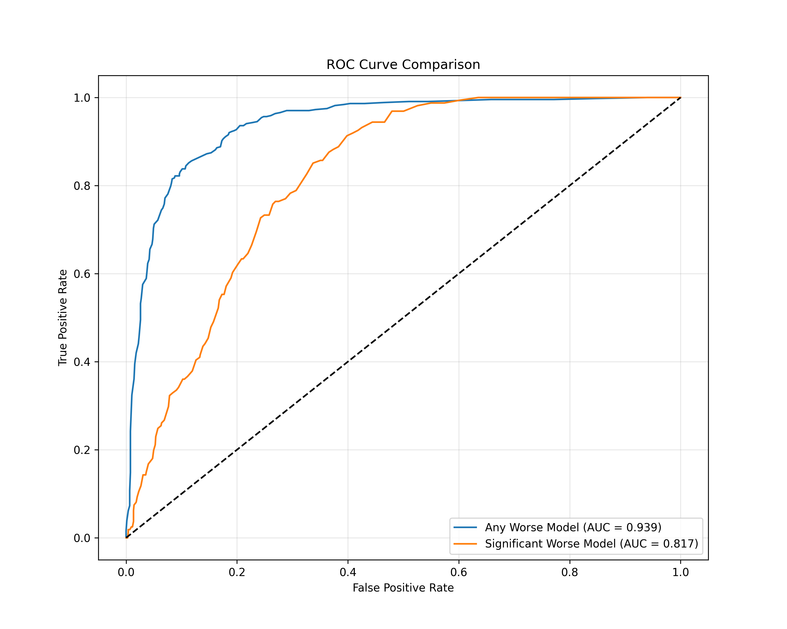

The feature importance analysis of these refined models revealed that raw force measurements (leftMaxForce, rightMaxForce) and the remaining symmetry metrics (ForceSymmetry, ImpulseSymmetry) were the most informative features for predicting asymmetry, as shown in Figure 5.

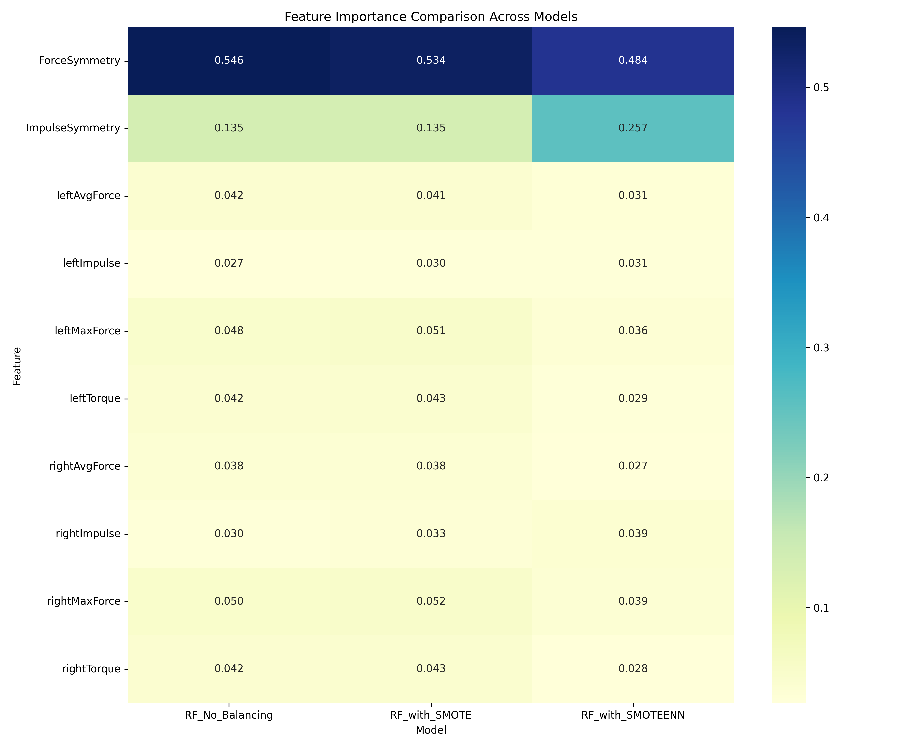

This pattern was consistent across all model variations, further validating the robustness of our findings. The strong performance of these refined models (F1 scores of 0.888-0.985) confirms that our biomechanical measurements contained genuine predictive signal even when controlling for data leakage.

## Cross-Sport Analysis Results

Our cross-sport analysis revealed both common patterns and sport-specific differences in biomechanical asymmetry. The combined model, trained on data from all sports, demonstrated strong overall performance with an accuracy of 0.903, an F1 score of 0.884, and an ROC AUC of 0.983. This indicates that there are indeed generalizable patterns of asymmetry that transcend sport-specific movement patterns.

Sport-specific models showed varying performance metrics, with some sports demonstrating notably higher or lower predictive accuracy than the combined model. As shown in Figure 6, the baseball-specific model (n=205) achieved the highest performance among individual sport models with an accuracy of 0.951, an F1 score of 0.933, and an ROC AUC of 0.988. Other high-performing sport-specific models included women's lacrosse (accuracy=0.895, F1=0.892) and softball (accuracy=0.895, F1=0.875).

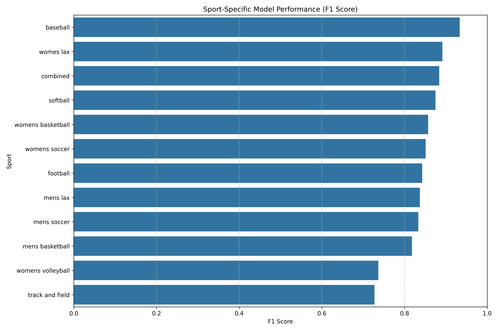

Sports with smaller sample sizes generally showed lower performance metrics, with track and field (n=87) demonstrating the lowest performance (accuracy=0.833, F1=0.727). This suggests that larger sample sizes are beneficial for developing robust sport-specific asymmetry prediction models.

The distribution of athletes across different sports in our dataset can be seen in Figure 7, with football (n=972) and women's lacrosse (n=429) having the largest representation.

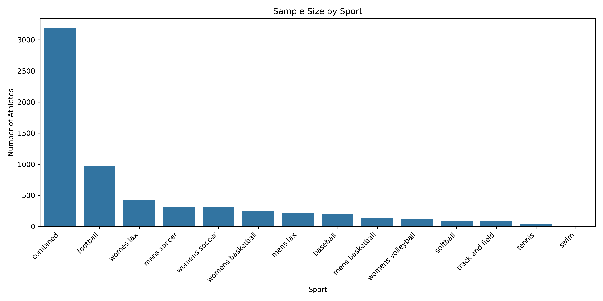

The asymmetry rates varied considerably across sports as shown in Figure 8, with some sports showing significantly higher rates of biomechanical asymmetry than others. These asymmetry patterns serve as our proxy for injury risk, with higher asymmetry being associated with potentially higher injury risk.

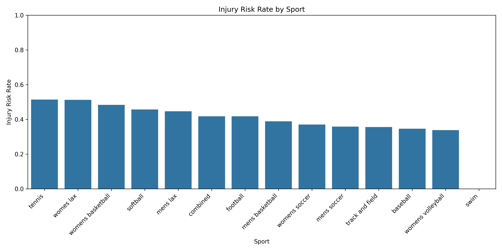

## Sport-Specific Asymmetry Patterns

Our analysis revealed distinct patterns of biomechanical asymmetry across different sports. Figure 9 shows the distribution of ForceSymmetry asymmetry by sport, highlighting which sports tend to have higher degrees of asymmetry.

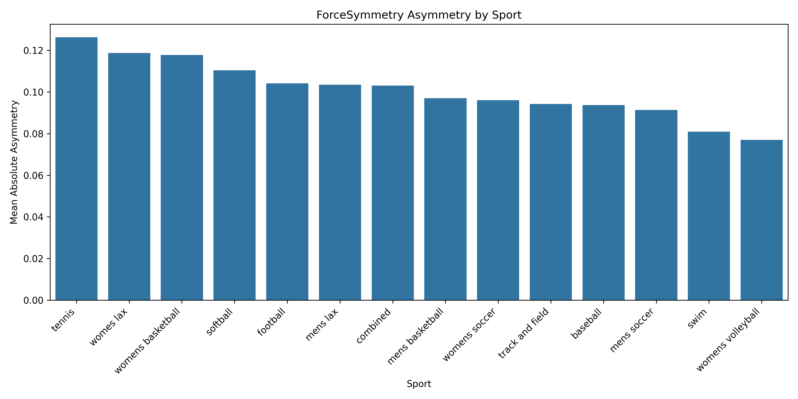

The relationship between asymmetry and risk status also varied across sports, as shown in Figure 10, which compares the asymmetry metrics between high-risk and low-risk athletes across different sports.

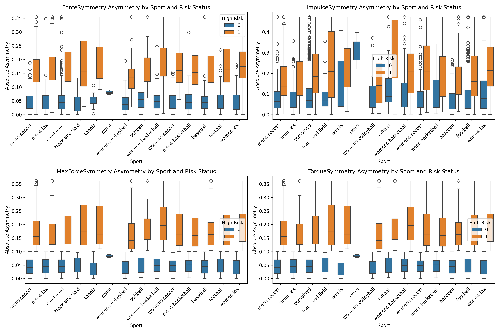

These sport-specific patterns suggest that normative standards for symmetry should be calibrated differently across sports, taking into account the unique biomechanical demands of each activity.

## Performance Decline Prediction Results

Beyond addressing data leakage, we further advanced our methodology by shifting from static asymmetry classification to longitudinal performance decline prediction. This approach represented a significant advancement in both methodological rigor and clinical utility.

Among the 6,372 athletes in our dataset, we identified 334 athletes with multiple tests. After processing these sequential measurements, we created a longitudinal dataset containing 6,038 paired observations (initial test and subsequent test) from athletes with at least two tests.

Analysis of performance decline targets revealed that 36.2% of athletes showed worsening in at least one symmetry metric between consecutive tests (any_symmetry_worse). A more stringent definition of significant worsening (>10% change in symmetry metrics) identified 13.3% of athletes as experiencing significant symmetry decline.

The distribution of decline severity is illustrated in Figure 11, showing the proportion of athletes experiencing different levels of performance decline.

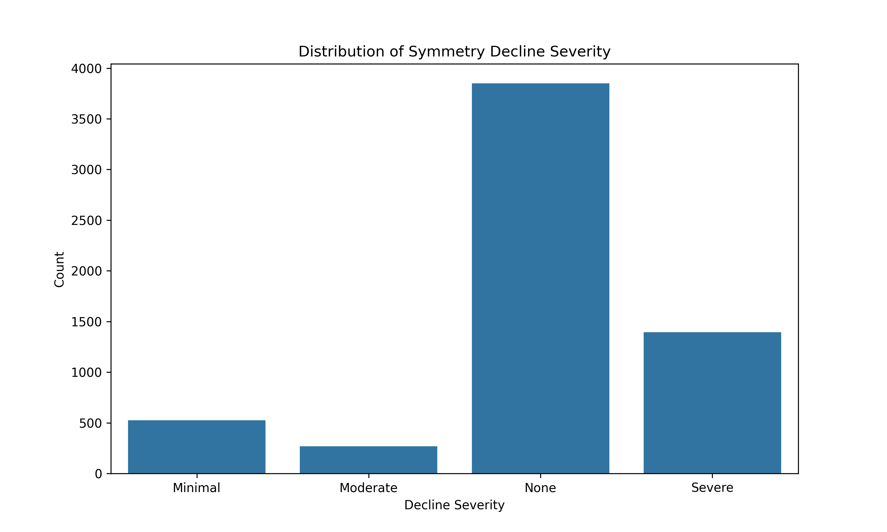

Predictive models for performance decline were trained using only features available at the initial test, making them genuinely predictive of future outcomes. The model for predicting any symmetry worsening achieved the following results:
- Accuracy: 0.874
- Precision: 0.811
- Recall: 0.852
- F1 Score: 0.831
- ROC AUC: 0.939

Models for predicting significant symmetry worsening showed more moderate performance:
- Accuracy: 0.793
- Precision: 0.331
- Recall: 0.540
- F1 Score: 0.410
- ROC AUC: 0.817

Feature importance analysis for these longitudinal prediction models revealed that initial values of ForceSymmetry and ImpulseSymmetry were the strongest predictors of future symmetry deterioration, as shown in Figures 12 and 13.

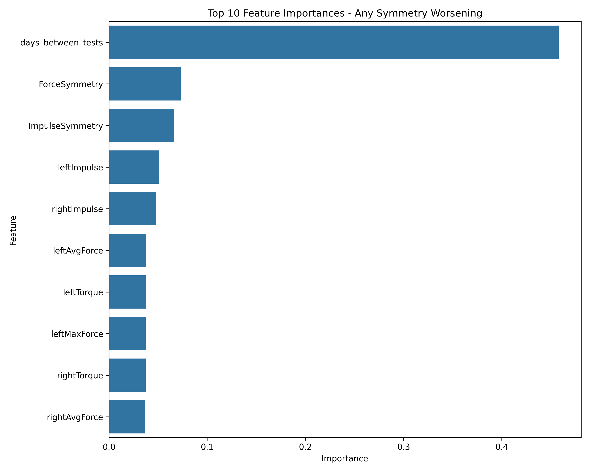

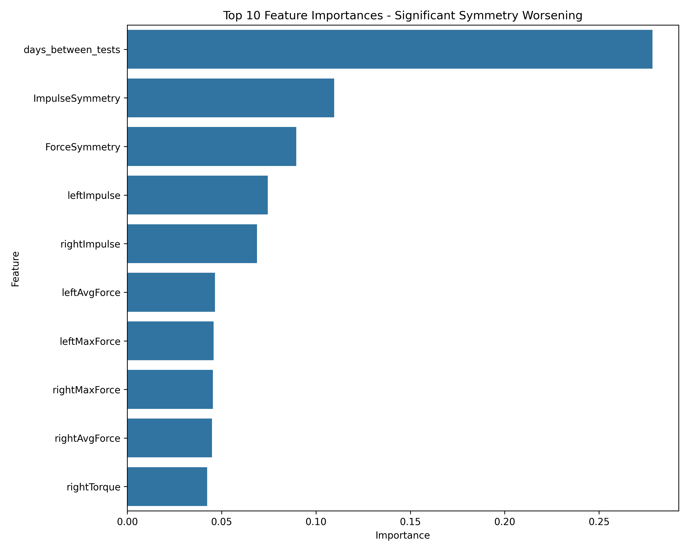

Time between tests emerged as a significant predictor, with longer intervals between tests associated with higher probabilities of significant symmetry decline, as illustrated in Figure 14. This finding highlights the importance of regular testing in monitoring athlete biomechanical health.

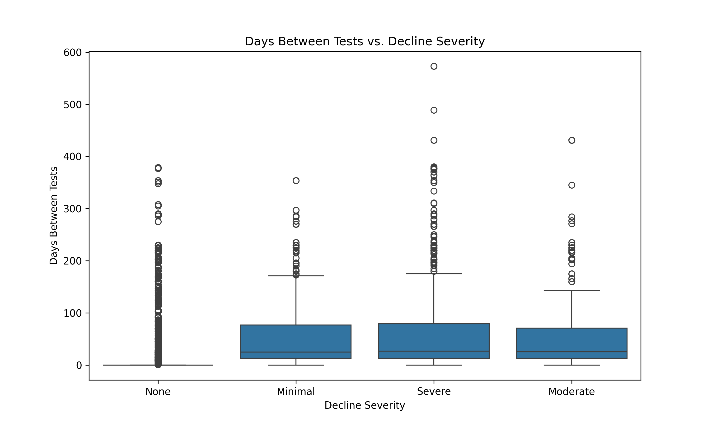

## Athlete Progress Analysis

Our analysis of athlete progress over time revealed interesting patterns in biomechanical symmetry evolution. Figure 15 shows an example of how various force metrics changed over time for a sample athlete.

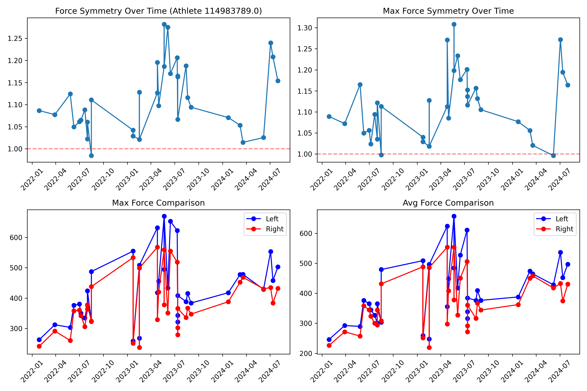

Improvement analysis based on 20 athletes with multiple tests showed that:
- Force symmetry improved in 35.0% of athletes
- Max force symmetry improved in 40.0% of athletes
- Average left force increased by 27.4% on average
- Average right force increased by 22.8% on average

These findings suggest that while many athletes show improvement in symmetry metrics over time, a substantial proportion experience deterioration, highlighting the importance of ongoing monitoring and intervention.

## Cluster Analysis

Cluster analysis revealed that athletes naturally grouped into distinct biomechanical profiles. Silhouette score analysis (Figure 16) indicated that the optimal number of clusters was 2, suggesting two primary biomechanical profiles among the athletes in our dataset.

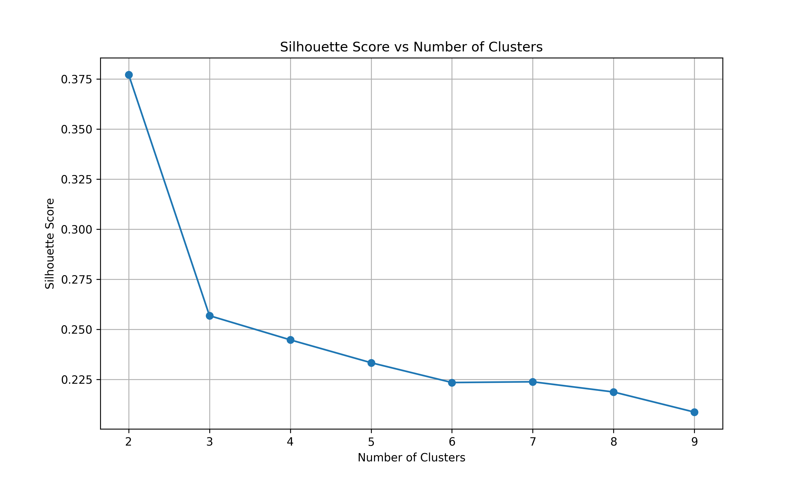

Figure 17 visualizes these clusters using Principal Component Analysis (PCA), showing clear separation between the two groups.

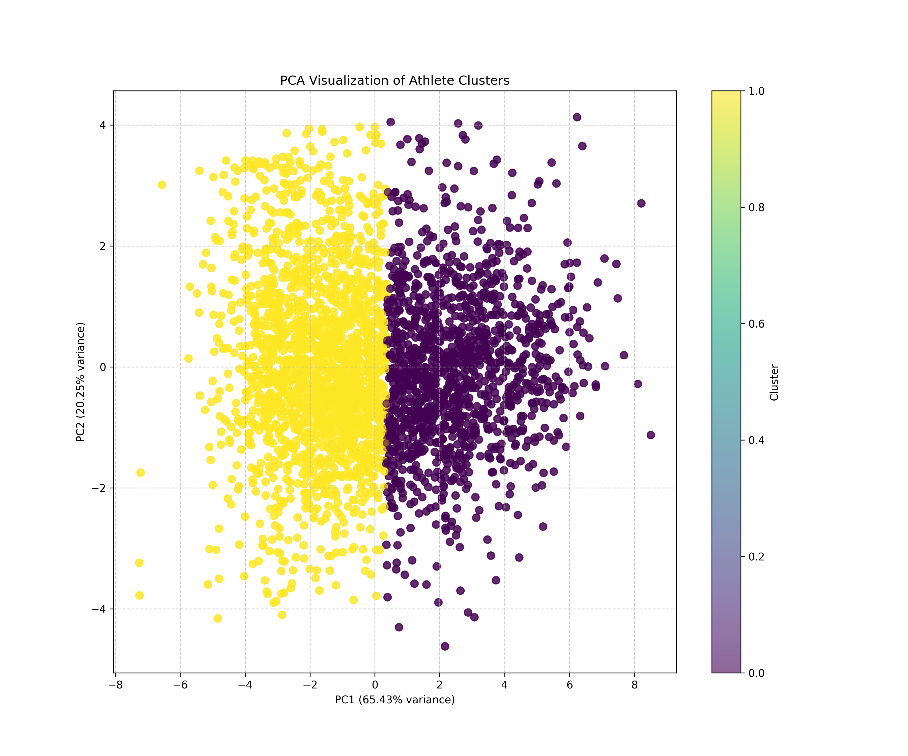

The injury risk rates differed significantly between the two clusters as shown in Table 2, with Cluster 1 showing a substantially higher risk rate than Cluster 0.

**Table 2: Injury Risk by Cluster**
| Cluster | Injury Risk Rate (%) | Count |
|---------|----------------------|-------|
| 1       | 67.9                 | 2530  |
| 0       | 24.1                 | 3842  |

This finding suggests that biomechanical clustering could provide a valuable approach for risk stratification in athletic populations.

## Comparison of Methodological Approaches

Comparing our three methodological approaches (original with data leakage, data leakage mitigated, and performance decline prediction), we observed a progression from potentially overly optimistic performance metrics to more realistic assessments of predictive capability.

The F1 score comparison (Figure 18) demonstrates the differences in performance across methodological approaches, with the performance decline prediction models showing more moderate performance than the static classification models.

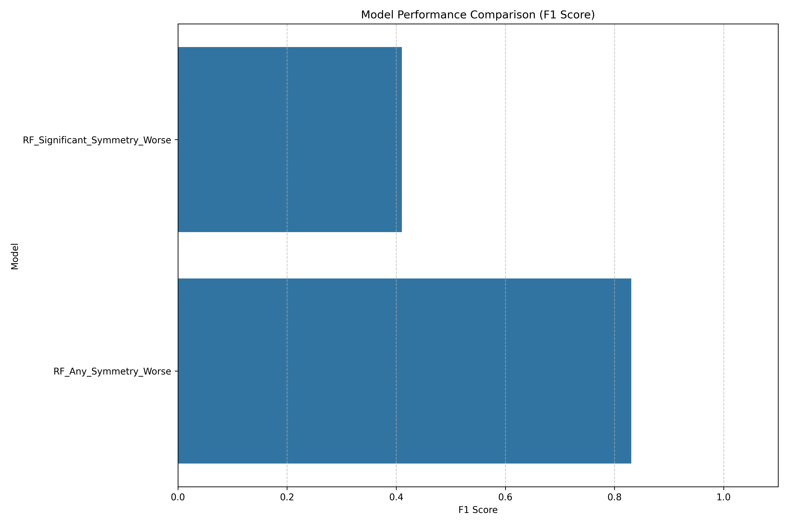

This methodological evolution reflects a broader principle in sports science research: the importance of distinguishing between descriptive models (which characterize current states) and predictive models (which forecast future outcomes). Our progression from potentially overfit models with circular logic to more rigorous longitudinal predictive frameworks strengthens the scientific foundation of our work and enhances its potential clinical applications.